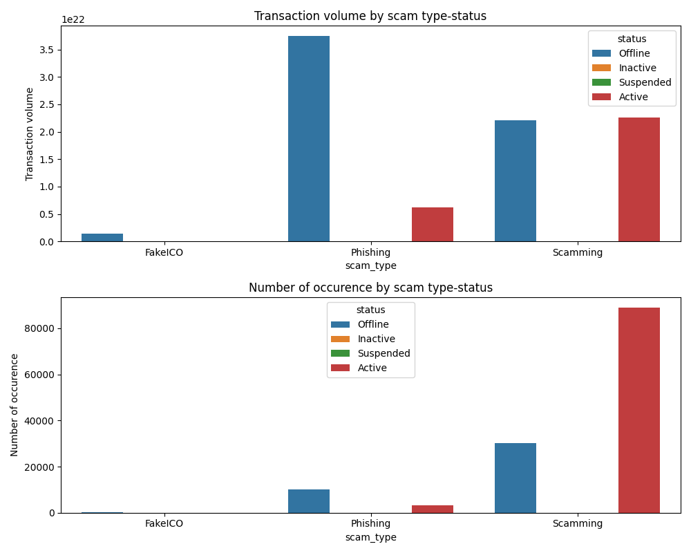

% Analysis of Ethereum Transactions and Smart Contracts Report
% Minh Duc Nguyen
% Apr 2022

---
toc: true
indent: true
geometry: a4paper
header-includes: |
    \usepackage{fancyhdr}
    \pagestyle{fancy}
    \fancyhead[CO,CE]{}
    \fancyfoot[CO,CE]{Click on hyperlinks to access source code/file/link}
    \fancyfoot[LE,RO]{\thepage}
---

\newpage
## I. Part A – Time analysis

#### &nbsp; a) Requirement
Create a bar plot showing the number of transactions occurring every month between the start and end of the dataset. Create a bar plot showing the average value of transactions in each month between the start and end of the dataset.

#### &nbsp; b) Source code (For detailed comments for each step, navigate to the source code file using the hyperlink)
[a_part.py](./a_part/a_part.py) - Getting total transactions’ values and total occurrence per year-month.

[a_part_plot.py](./a_part/a_part_plot.py) - Plotting two required charts from the a_part.py output data.

Job ID: [http://andromeda.student.eecs.qmul.ac.uk:8088/proxy/application_1649894236110_5371/](http://andromeda.student.eecs.qmul.ac.uk:8088/proxy/application_1649894236110_5371/)

#### &nbsp; c) Deliverable - Charts

## II. Part B – Top ten popular services
#### &nbsp; a) Requirement
Evaluate the top 10 smart contracts by total Ether received. An outline of the subtasks required to extract this information is provided below, focusing on an MRJob-based approach. This is, however, is not the only way to complete the task, as there are several other viable ways of completing this assignment.

#### &nbsp; b) Source code (For detailed comments for each step, navigate to the source code file using the hyperlink)
[b_part.py](./b_part/b_part.py) - Multi-steps Hadoop/MapReduce task to:

- Perform a repartition left join between contracts and transactions data, filter transactions with value 0.

- Aggregate using sum to get the top 10 most popular services by transaction value.

Job ID:

- [http://andromeda.student.eecs.qmul.ac.uk:8088/proxy/application_1649894236110_3685/](http://andromeda.student.eecs.qmul.ac.uk:8088/proxy/application_1649894236110_3685/)

- [http://andromeda.student.eecs.qmul.ac.uk:8088/proxy/application_1649894236110_3786/](http://andromeda.student.eecs.qmul.ac.uk:8088/proxy/application_1649894236110_3786/)

#### &nbsp; c) Deliverable - Top ten popular services (in wei)
|**Smart contracts**|**Total wei received**|
|----|----|
|0xaa1a6e3e6ef20068f7f8d8c835d2d22fd5116444|84155100809965865822726776|
|0xfa52274dd61e1643d2205169732f29114bc240b3|45787484483189352986478805|
|0x7727e5113d1d161373623e5f49fd568b4f543a9e|45620624001350712557268573|
|0x209c4784ab1e8183cf58ca33cb740efbf3fc18ef|43170356092262468919298969|
|0x6fc82a5fe25a5cdb58bc74600a40a69c065263f8|27068921582019542499882877|
|0xbfc39b6f805a9e40e77291aff27aee3c96915bdd|21104195138093660050000000|
|0xe94b04a0fed112f3664e45adb2b8915693dd5ff3|15562398956802112254719409|
|0xbb9bc244d798123fde783fcc1c72d3bb8c189413|11983608729202893846818681|
|0xabbb6bebfa05aa13e908eaa492bd7a8343760477|11706457177940895521770404|
|0x341e790174e3a4d35b65fdc067b6b5634a61caea|8379000751917755624057500|

## III. Part C – Top ten most active miners
#### &nbsp; a) Requirement
Evaluate the top 10 miners by the size of the blocks mined. This is simpler as it does not require a join. You will first have to aggregate blocks to see how much each miner has been involved. You will want to aggregate the size for addresses in the miner field. This will be similar to the word count that we saw in Lab 1 and Lab 2. You can add each value from the reducer to a list and then sort the list to obtain the most active miners.

#### &nbsp; b) Source code (For detailed comments for each step, navigate to the source code file using the hyperlink)
[c_part.py](./c_part/c_part.py) - Multi-steps Hadoop/MapReduce task to:

- Perform a map-reduce to get aggregated (None, (Miner address, Size)) for sorting.

- A reducer step to get top 10 miners.

#### &nbsp; c) Deliverable - Top ten most active miners
|**Miner's address**|**Total mined size**|
|----|----|
|0xea674fdde714fd979de3edf0f56aa9716b898ec8|23989401188|
|0x829bd824b016326a401d083b33d092293333a830|15010222714|
|0x5a0b54d5dc17e0aadc383d2db43b0a0d3e029c4c|13978859941|
|0x52bc44d5378309ee2abf1539bf71de1b7d7be3b5|10998145387|
|0xb2930b35844a230f00e51431acae96fe543a0347|7842595276|
|0x2a65aca4d5fc5b5c859090a6c34d164135398226|3628875680|
|0x4bb96091ee9d802ed039c4d1a5f6216f90f81b01|1221833144|
|0xf3b9d2c81f2b24b0fa0acaaa865b7d9ced5fc2fb|1152472379|
|0x1e9939daaad6924ad004c2560e90804164900341|1080301927|
|0x61c808d82a3ac53231750dadc13c777b59310bd9|692942577|

## IV. Part D
### &nbsp; 1. Popular scams
#### &nbsp; &nbsp; a) Requirement
Utilising the provided scam dataset, what is the most lucrative form of scam? Does this correlate with certainly known scams going offline/inactive? For the correlation, you could produce the count of how many scams for each category are active/inactive/offline/online/etc and try to correlate it with volume (value) to make conclusions on whether state plays a factor in making some scams more lucrative. Therefore, by getting the volume and state of each scam, you can make a conclusion whether the most lucrative ones are ones that are online or offline or active or inactive.

#### &nbsp; &nbsp; b) Source code (For detailed comments for each step, navigate to the source code file using the hyperlink)

**Data preprocessing and evaluation**
[d_part_scam_extract_json.py](./d_part_scam/d_part_scam_extract_json.py) - A python script to locally extract data for all related addresses with each scam from scams.json to text file for ease of use.

[d_part_scam_check_dup.py](./d_part_scam/d_part_scam_check_dup.py) - A small map-reduce job for a sanity check on addresses with several forms of scams/statuses. (With the [result](./d_part_scam/d_part_scam_check_dup.txt) there are 15 cases with two types of scams/statuses. Considering the minimal impact, we begin to analyse with a small change in the logic).

**Data processing**
[d_part_scam_data.py](./d_part_scam/d_part_scam_data.py) - Multi-steps Hadoop/MapReduce task to:

- Do a repartition join between transactions and scams (extracted from the previous step) data set by address key.

- Change dimension from address to scam type, status to aggregate total transaction volume, the number of occurrences (per address related).

**Reporting data**
[d_part_scam_report.py](./d_part_scam/d_part_scam_report.py) - A python script to aggregate data from previous step for reporting insights.

#### &nbsp; &nbsp; c) Deliverable - Report                       

|**Scam type**|**Metric**|**Volume**|
|---|---|---|
|FakeICO|count|1.210000e+02|
||sum|1.356458e+21|
|Phishing|count|1.331100e+04|
||sum|4.372701e+22|
|Scamming|count|1.194640e+05|
||sum|4.471581e+22|
**What is the most lucrative form of scam?** From the data table above, in terms of both occurrence and transaction volume, the “Scamming” type is the most lucrative form of scam. However, "Scamming" is an umbrella term. Therefore, we could safely infer that "Phishing" is the most lucrative form.

**Does this correlate with certainly known scams going offline/inactive?**

- As we could see, there are some positive correlations between the numbers of occurrences and transaction volume for Phishing/FakeICO. However, it is not the same for Scamming type.

- For the Scamming type, the most lucrative one is Active.

- For the Phishing type, the most lucrative one is Offline.

### &nbsp; 2. Fork the Chain
#### &nbsp; &nbsp; a) Requirement
There have been several forks of Ethereum in the past. Identify one or more of these and see what effect it had on price and general usage. For example, did a price surge/plummet occur, and who profited most from this?

#### &nbsp; &nbsp; b) Source code (For detailed comments for each step, navigate to the source code file using the hyperlink)

[d_part_fork_analysis.py](./d_part_fork_analysis/d_part_fork_analysis.py) - A Spark job to:

- Differentiate different fork events based on block number^[[Wikipedia Ethereum](https://en.wikipedia.org/wiki/Ethereum)]

- Join with close [price data](./d_part_fork_analysis/ETHUSD.txt) of Ethereum scraping from [Coinmarketcap](https://coinmarketcap.com/currencies/ethereum/historical-data/) in USD^[There were days with unavailable price data being filled with the nearest date's price]

[d_part_fork_analysis_report.py](./d_part_fork_analysis/d_part_fork_analysis_report.py) - A Python script to cleanse the output data, plot chart and extracting insights for the report

#### &nbsp; &nbsp; c) Deliverable - Analysis report

|**Date**|**Event**|**Average price last two weeks**|**Average price next two weeks**|**% Change in average price**|
|---|---|---|---|---|
|2015-09-08|Ice Age|1.267857|0.947571| -25.26%|
|2016-03-15|Homestead|11.167143|11.133571| -0.30%|
|2016-07-20|DAO Fork|11.206429|12.275714| 9.54%|
|2016-10-18|Tangerine Whistle|12.197143|11.495| -5.76%|
|2016-11-23|Spurious Dragon|9.936429|8.245| -17.02%|
|2017-10-16|Byzantium|311.609286|301.816429| -3.14%|
|2019-02-28|Constantinople|140.043893|135.030217| -3.58%|

**Table 1. Comparing the average price change within the last and next two weeks from the fork date**

|**Date**|**Event**|**Total wei transaction last two weeks**|**Total wei transaction last next two weeks**|**% Change in total transaction**|
|---|---|---|---|---|
|2015-09-08|Ice Age|5.58E+24|5.52E+24|-0.98%|
|2016-03-15|Homestead|2.47E+25|1.38E+25|-44.01%|
|2016-07-20|DAO Fork|3.86E+25|1.08E+26|180.02%|
|2016-10-18|Tangerine Whistle|2.52E+25|1.69E+25|-32.75%|
|2016-11-23|Spurious Dragon|2.00E+25|3.03E+25|51.25%|
|2017-10-16|Byzantium|1.48E+26|1.58E+26| 6.69%|
|2019-02-28|Constantinople|3.20E+25|2.94E+25|-8.20%|

**Table 2. Comparing the total usage (transaction amount) within the last and next two weeks from the fork date**

&nbsp;

**Commentary**

- Considering every fork could make a huge impact on the usage/price of Ethereum. This could be an instrument to drive the Ethereum market.

- Furthermore, every Ethereum owner would receive the new token with the same amount as their Ethereum amount after the fork. This could be an incentive for holding/hoarding Ethereum before each fork. And, Potentially, huge sell-outs after each fork which were reflected in table 1.

- In conclusion, the more Ethereum an owner had, the more profit they gained from each fork.

### &nbsp; 3. Gas guzzlers
#### &nbsp; &nbsp; * a) Requirement
For any transaction on Ethereum, a user must supply gas. How has the gas price changed over time? Have contracts become more complicated, requiring more gas, or less so? Also, could you correlate the complexity for some of the top-10 contracts found in Part B by observing the change in their transactions

#### &nbsp; &nbsp; b) Source code (For detailed comments for each step, navigate to the source code file using the hyperlink)
[d_part_gas_guzzler.py](./d_part_gas_guzzler/d_part_gas_guzzler.py) - A spark job to: 

- Map between transactions, contracts, and top contracts (result from part B) data sets

- Generate an address type dimension on the way to do the gas price analysis between each type

[d_part_gas_guzzler_analysis.py](./d_part_gas_guzzler/d_part_gas_guzzler_analysis.py) - A quick code to generate a barplot for analysing the gas price trend between each address type through time

#### &nbsp; &nbsp; c) Deliverable - Chart & Commentary
**Chart**

**Commentary**

**How has the gas price changed over time?** Overall, we could see the downtrend in the gas price.

**Have contracts become more complicated, requiring more gas, or less so?**

- There are 3 distinct periods that could be observed from this period. Before Q2 2016, where smart contracts were usually more complicated than normal wallets on average.

- After Q2 2016, the average gas price for smart contracts and normal wallets stayed roughly the same. The average price per transaction for smart contracts sometimes was slightly higher during this period.

- Except for Dec 2016, where there was a pump in gas price for normal wallets.

**Also, could you correlate the complexity for some of the top-10 contracts found in Part B by observing the change in their transactions.**

- As we could see, the top ten popular contracts of this data set were from Q2 2016.

- During the period Q2 2016 to the end of Q1 2017, the average gas price per transaction had stayed roughly the same for all three types except for Dec 2016.

- From Q2 2017, the average gas price per transaction of the top ten popular contracts had been consistently higher than the other two with an exception of Feb 2019.

### &nbsp; 4. Comparative evaluation
#### &nbsp; &nbsp; * a) Requirement
Reimplement Part B in Spark (if your original was MRJob or vice versa). How does it run in comparison? Keep in mind that to get representative results you will have to run the job multiple times, and report median/average results. Can you explain the reason for these results? What framework seems more appropriate for this task? 

#### &nbsp; &nbsp; b) Source code (For detailed comments for each step, navigate to the source code file using the hyperlink)
[d_part_comparative_evaluation.py](./d_part_comparative_evaluation/d_part_comparative_evaluation.py) - A spark job with the same objective as Part B to evaluate performance

[d_part_comparative_evaluation.txt](./d_part_comparative_evaluation/d_part_comparative_evaluation.txt) - An output text file to log the runtimes of different executions

#### &nbsp; &nbsp; c) Deliverable - Performance report & Commentary

|**Runtime**|**Spark**|**MapReduce**|
|---|---|---|
|**1st**|110.663076878|125.119294405|
|**2nd**|122.247198551|112.667238644|
|**3rd**|104.098869553|120.955614206|
|**4th**|108.583358127|122.505109383|
|**5th**|113.403694996|118.575467115|
|---------|
|**Average**|111.799239621|119.964544750|
|**Median**|110.663076878|120.955614206|

**Chart 1. Benchmarking based on a subset of transactions & contracts data set**

||**Spark**|**MapReduce**|
|---|---|---|
|**Runtime**|124.950928926|2076.626327991|

**Chart 2. Benchmarking based on whole transactions & contracts data set**

&nbsp;

**Commentary**

- **Observation**: In chart 1, Spark job ran slightly better than MapReduce. 

- **Observation**: Spark ran significantly faster compared to Hadoop/MapReduce with chart 2. In this case, we could safely assume that the variance in performance due to network traffic could be ignored.

- **Reason**: The MRjob job consisted of 2 steps. Therefore, it needed to write a large amount of data into the HDFS with the intermediate results. This was the reason for the huge difference in performance.

- **Conclusion**: For this task, Spark seems to be more appropriate. 